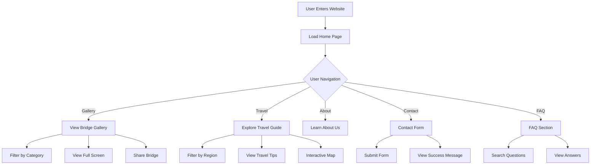
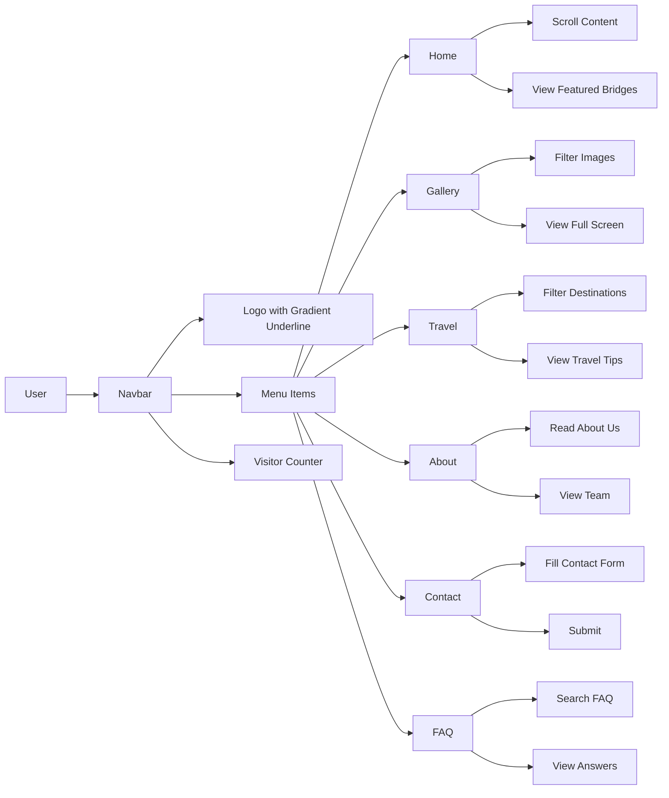
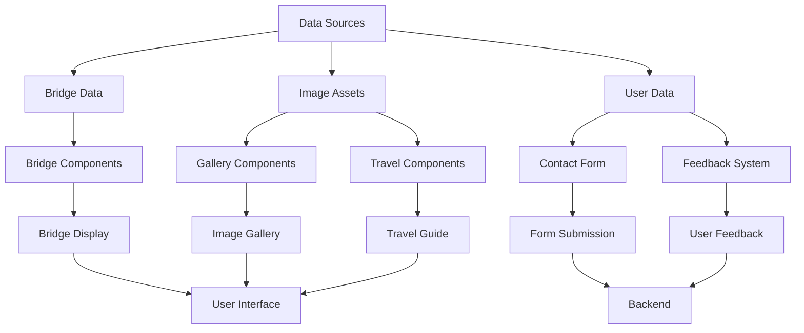
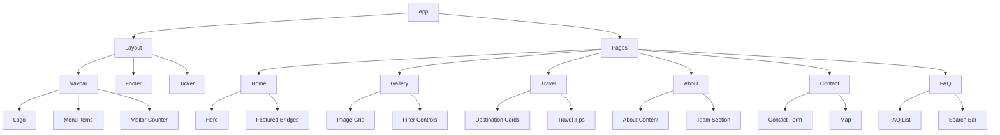
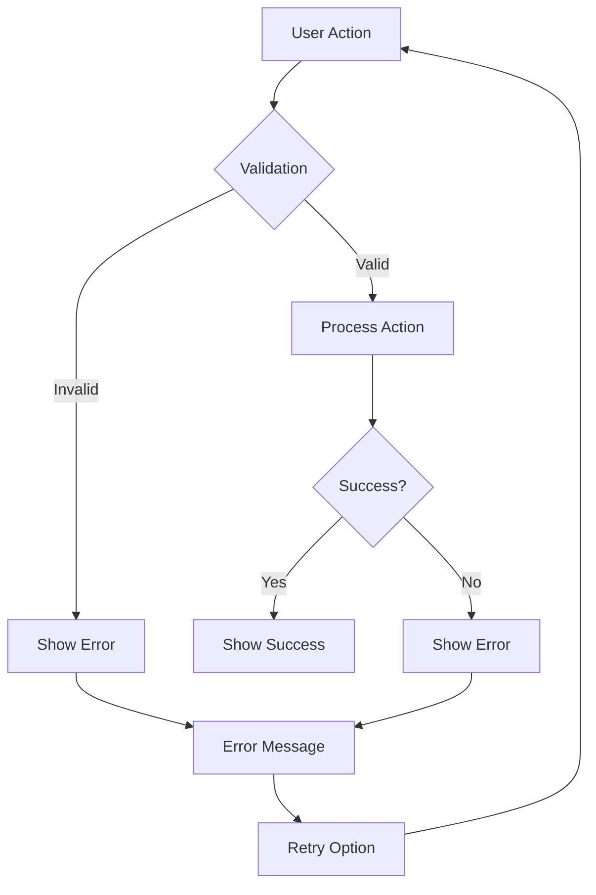
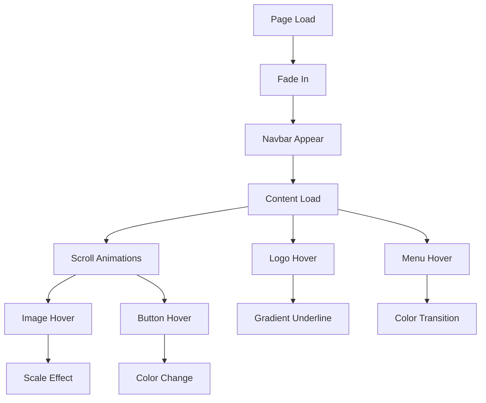

# Bridges Website - Flow Charts

## Table of Contents
1. [Application Flow](#application-flow)
2. [User Interaction Flow](#user-interaction-flow)
3. [Data Flow](#data-flow)
4. [Component Hierarchy](#component-hierarchy)
5. [Error Handling Flow](#error-handling-flow)
6. [Animation Flow](#animation-flow)

## Application Flow

## User Interaction Flow

## Data Flow

## Component Hierarchy

## Error Handling Flow

## Animation Flow

## Notes for Flow Charts
1. **Component Relationships**
   - Show clear parent-child relationships
   - Indicate data flow direction
   - Highlight component dependencies

2. **User Interactions**
   - Map user journey
   - Show decision points
   - Indicate feedback loops

3. **Data Management**
   - Show data transformation
   - Indicate state updates
   - Highlight data dependencies

4. **Error Handling**
   - Show error paths
   - Indicate recovery steps
   - Highlight user feedback

5. **Performance**
   - Show optimization points
   - Indicate caching strategy
   - Highlight critical paths 