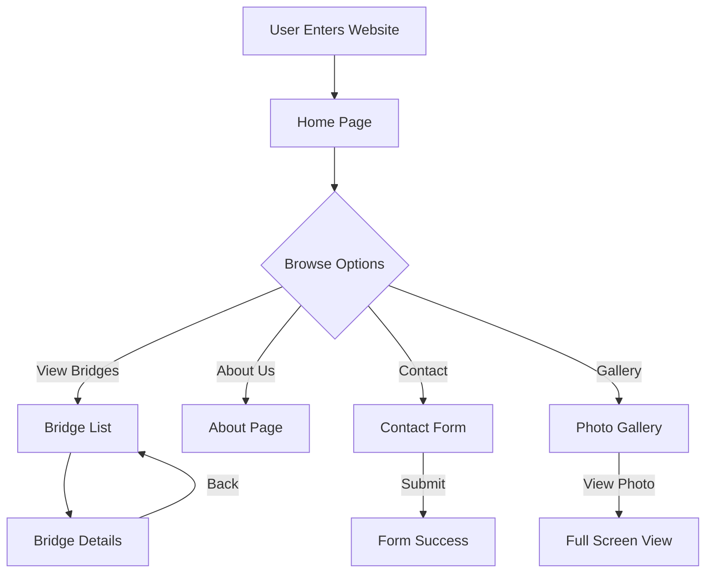
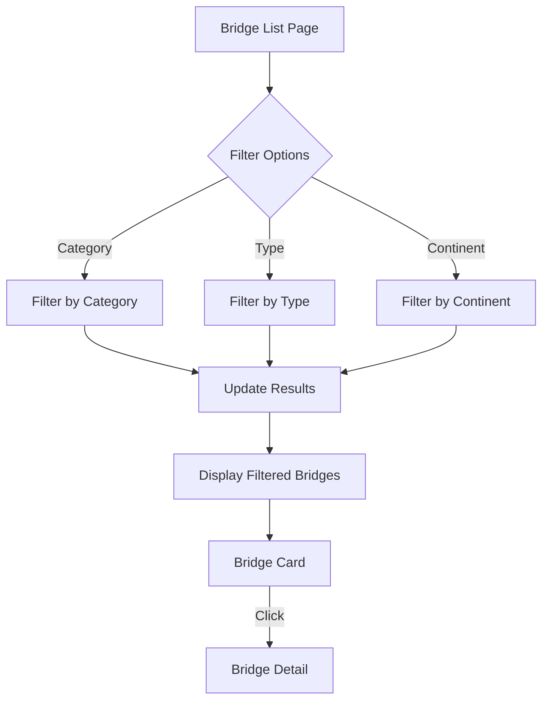
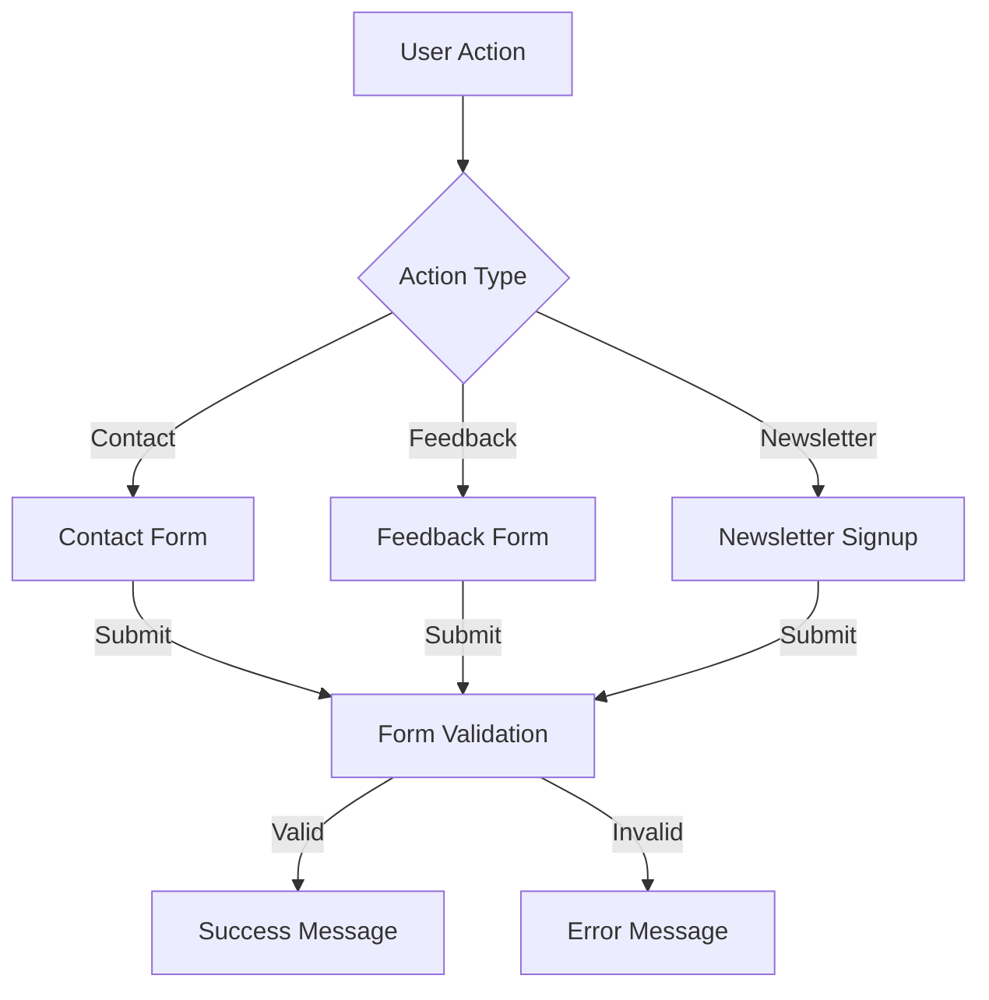
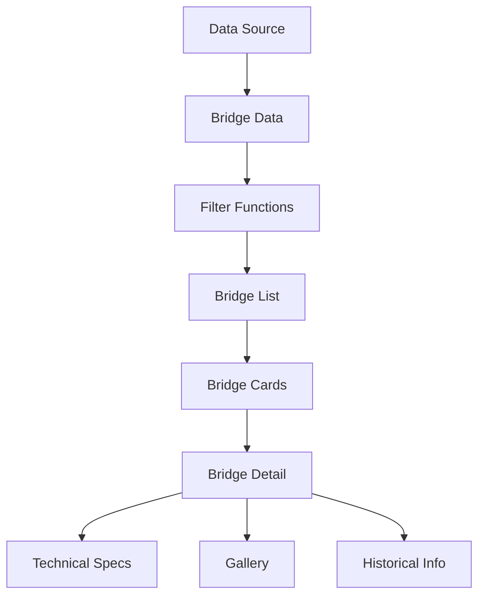
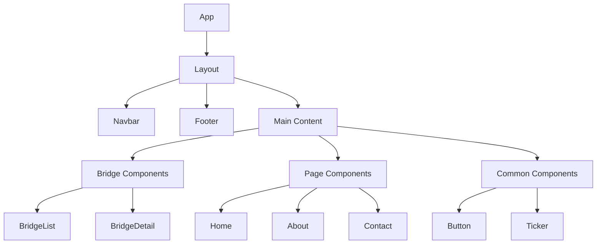
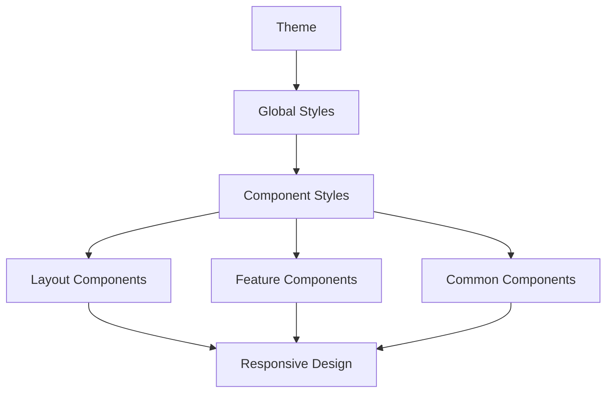
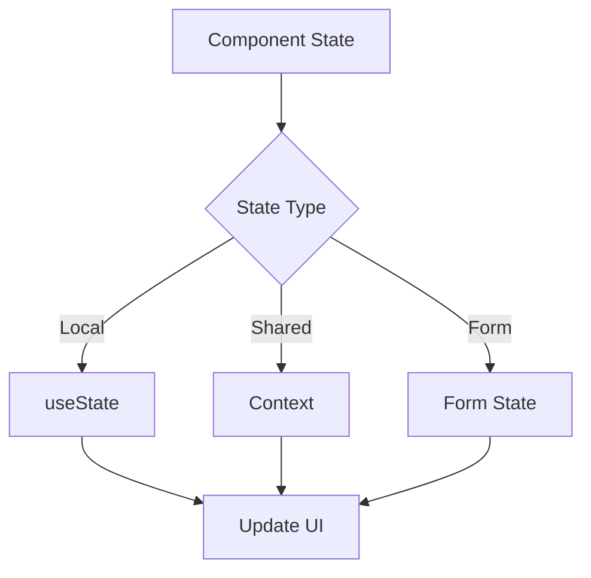
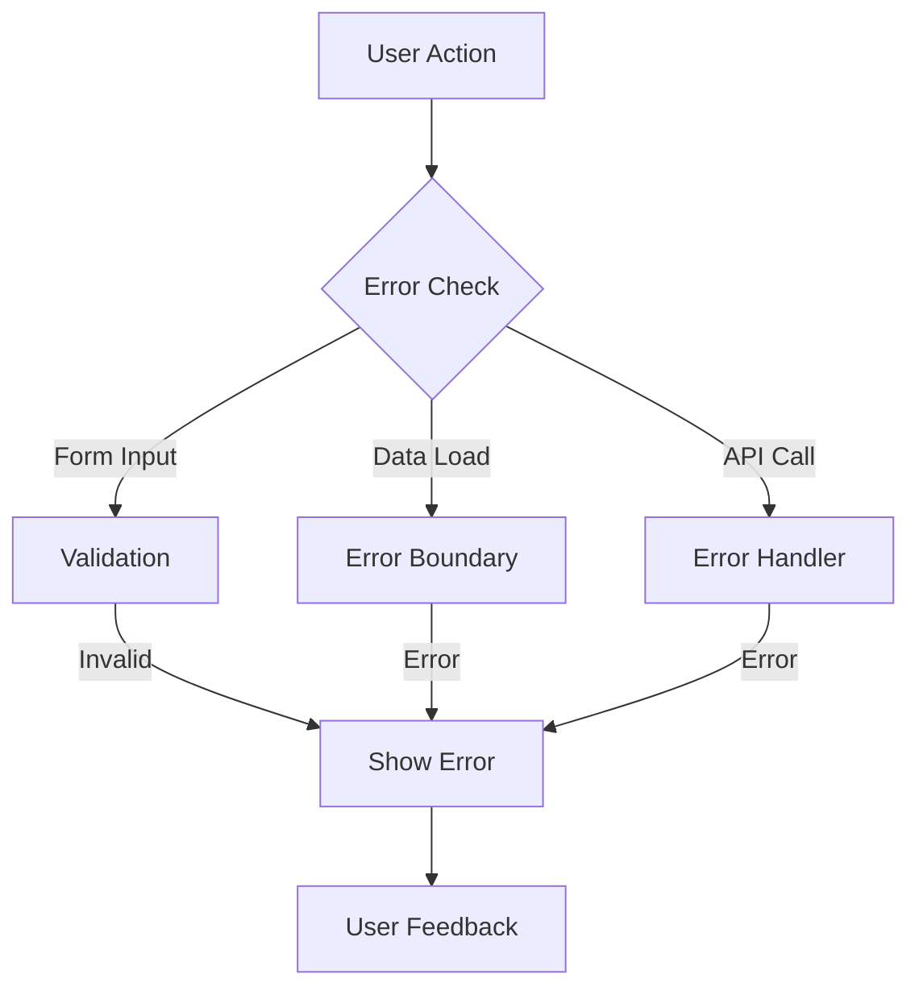
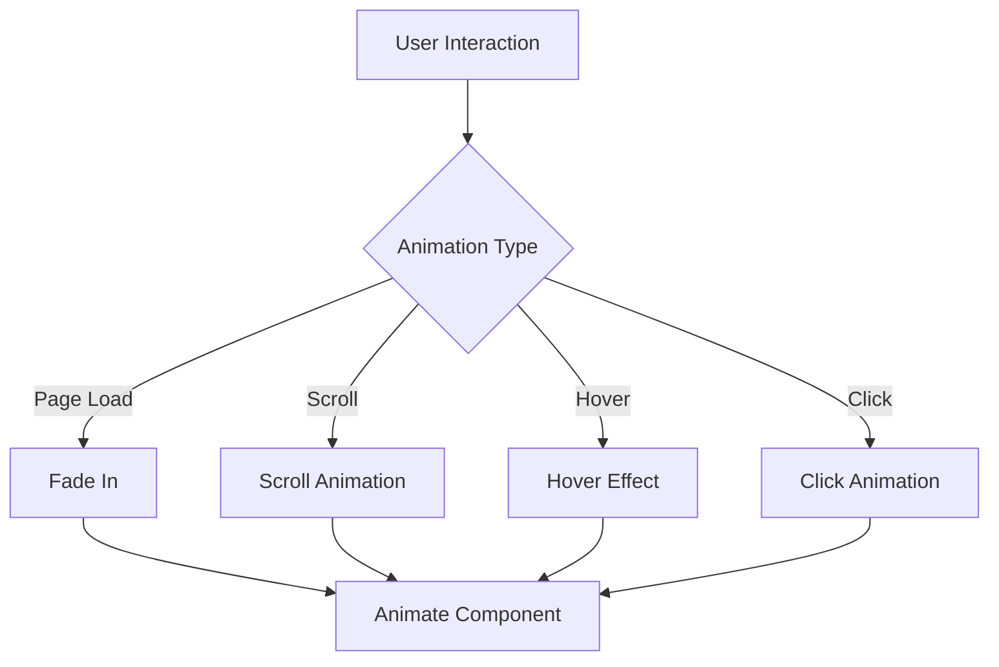
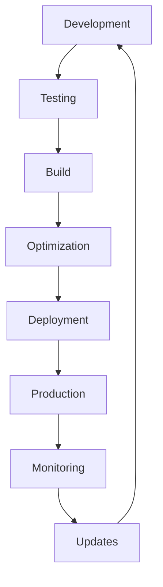

# Bridges Around the World - Flow Charts

## 1. Application Flow

## 2. Bridge List Flow

## 3. User Interaction Flow

## 4. Data Flow

## 5. Component Hierarchy

## 6. Styling Flow

## 7. State Management Flow

## 8. Error Handling Flow

## 9. Animation Flow

## 10. Deployment Flow

## Notes for Flow Charts
1. **Component Relationships**
   - Show clear parent-child relationships
   - Indicate data flow direction
   - Highlight component dependencies

2. **User Interactions**
   - Map user journey
   - Show decision points
   - Indicate feedback loops

3. **Data Management**
   - Show data transformation
   - Indicate state updates
   - Highlight data dependencies

4. **Error Handling**
   - Show error paths
   - Indicate recovery steps
   - Highlight user feedback

5. **Performance**
   - Show optimization points
   - Indicate caching strategy
   - Highlight critical paths 